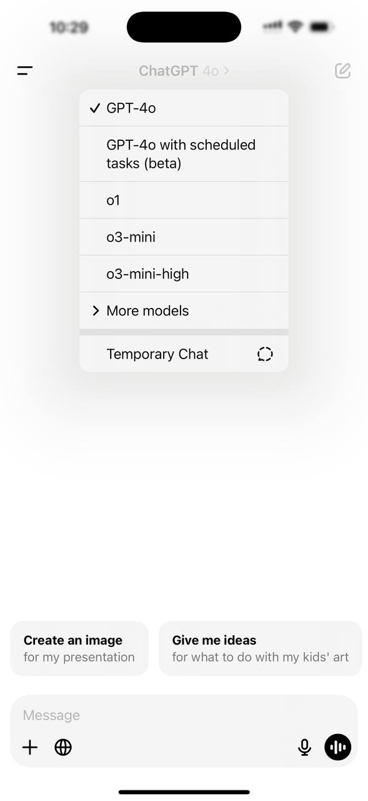
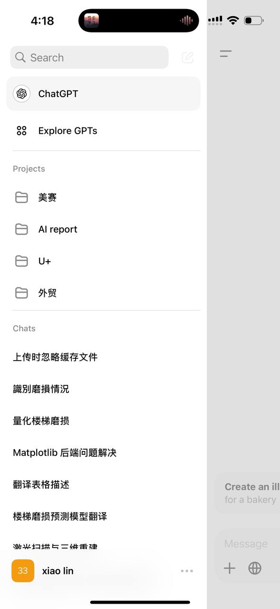
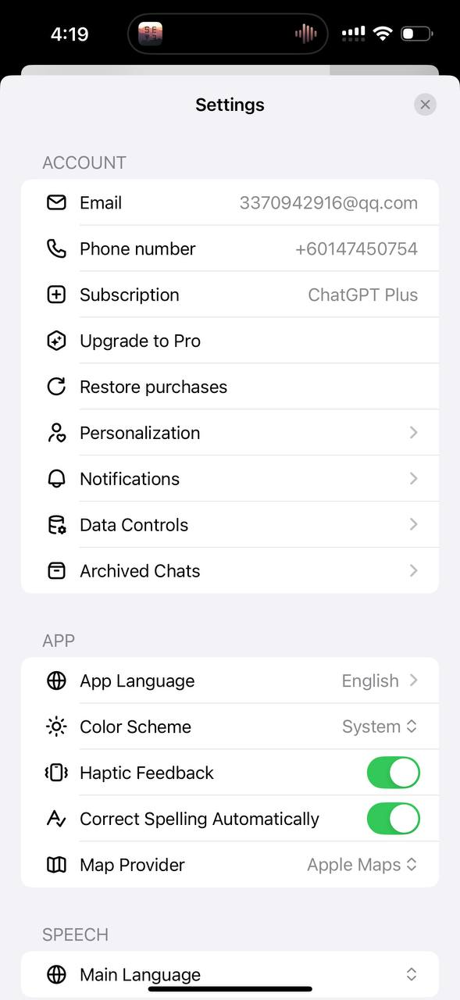
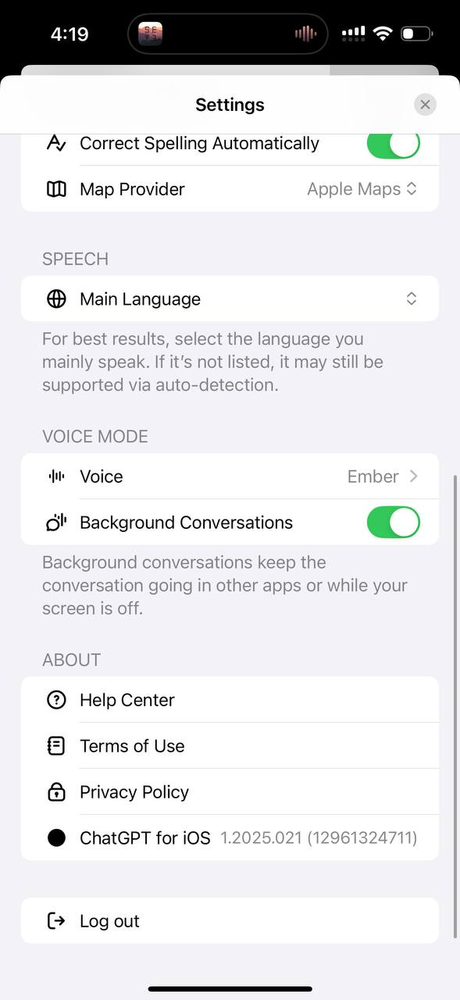

# AI_Box
## 项目介绍
AI_Box是一个可以调用各种AI模型的工具，如ChatGPT、Claude、Gemini等。

## 项目思路
整合各家AI模型，向用户收月费和年费。

## 收入与支出
收入：
1. 用户付费
2. 广场收入

支出：
1. 服务器费用
2. 模型api费用
3. 人工费用

## 广场介绍
在AI模型基础上开发的细分领域的AI应用，如AI生成PPT、AI语音转文本

## 项目技术栈
前端使用flutter开发，后端使用python的flask框架开发。数据库使用MySQL。

## UI参考
1. 主页面UI：
   1. ChatGPT直接改成AI Box 4o改成用户选择的模型（如：Gemini）
   2. 点击AI Box可以切换模型
   3. 下面的实时对话功能直接砍掉

2. 左侧菜单UI修改：
   1. Explorer GPTs直接换成Playground 跳转广场H5页面
   2. 直接砍掉Projects功能

1. 设置只保留必要的选项
    1.  
    
    2. 

